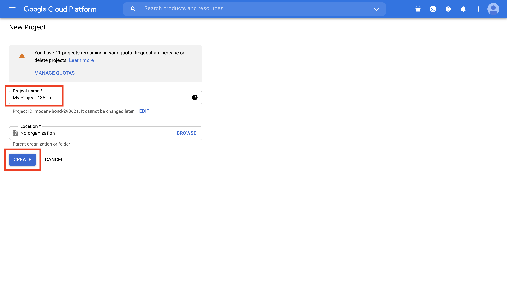

# Natural events tracker

### `Key Words: Google Cloud Platform API, NASA API, Deploy CRA on Heroku, Iconify, google-map-react.`

- #### Click here: [BACK TO NAVIGASTION](https://github.com/DonghaoWu/Frontend-tools-demo)

## `Section: Google-Map & NASA API.` (Basic)

### `Summary`: In this documentation, we learn to build a Front end application with Google map APi and NASA API.

### `Check Dependencies & Tools:`

- Frontend
    - create-react-app
    - google-map-react
    - uuid
    - @iconify-icons/carbon
    - @iconify-icons/fxemoji
    - @iconify-icons/openmoji
    - @iconify-icons/wpf
    - @iconify-icons/zmdi

------------------------------------------------------------

#### `本章背景：`
1. 

------------------------------------------------------------

### <span id="1.0">`Brief Contents & codes position`</span>

- #### Click here: [BACK TO NAVIGASTION](https://github.com/DonghaoWu/Frontend-tools-demo)

- [1.1 Initialization.](#1.1)
- [1.2 Frontend set up.](#1.2)
- [1.3 Deploy on Heroku.](#1.3)

------------------------------------------------------------


### <span id="1.1">`Step1: Initialization.`</span>

- #### Click here: [BACK TO CONTENT](#1.0)

1. Initialization:

    ```bash
    $ mkdir natural-events-tracker
    $ cd natural-events-tracker
    $ npx create-react-app .
    $ npm i google-map-react uuid @iconify-icons/carbon @iconify-icons/fxemoji @iconify-icons/openmoji @iconify-icons/wpf @iconify-icons/zmdi
    ```

2. Delete some files.

    - ./src/App.test.js
    - ./src/logo.svg
    - ./src/reportWebVitals.js
    - ./src/setupTest.js

    - Delete `import` code in other files related to the deleted files.
    - Change Title in the index.html file.

    -----------------------------------------------------------------

3. Create a Google api.

    1. `Create a project in Google Cloud Platform.`

    <p align="center">
    
    </p>

    <p align="center">
    
    </p>

    2. `Search Maps JavaScript API in library tab.`
    <p align="center">
    
    </p>

    <p align="center">
    
    </p>

    <p align="center">
    
    </p>

    3. `Enable the service.`

    <p align="center">
    
    </p>

    <p align="center">
    
    </p>

    4. `Create the API key.`
    <p align="center">
    
    </p>

    <p align="center">
    
    </p>

    <p align="center">
    
    </p>

    5. `Set up API key restriction.`:gem::gem::gem:
    <p align="center">
    
    </p>

    - For develop purpose, you could add localhost:3000 temporarily to the website restrictions list.

    -----------------------------------------------------------------

4. Create a .env file in root directory, create-react-app has the build in library to set up environment variables.

    ```js
    REACT_APP_GOOGLE_API=abcdefg
    ```

5. NASA EONET API.

    - [https://eonet.sci.gsfc.nasa.gov/api/v2.1/events](https://eonet.sci.gsfc.nasa.gov/api/v2.1/events)

#### `Comment:`
1. Source URL:
    - [Google Cloud Platform](https://cloud.google.com/)
    - [Adding Custom Environment Variables in CRA](https://create-react-app.dev/docs/adding-custom-environment-variables/)
    - [NASA open APIs](https://api.nasa.gov/)
    - [NASA EONET API documentation](https://eonet.sci.gsfc.nasa.gov/docs/v2.1)

------------------------------------------------------------

### <span id="1.2">`Step2: Frontend set up.`</span>

- #### Click here: [BACK TO CONTENT](#1.0)

1. App.js `(Fetch data from NASA)`

    ```jsx
    import { useState, useEffect } from 'react';
    import Loader from './components/Loader';
    import Header from './components/Header';
    import BaseMap from './components/BaseMap';

    import './App.css';

    const App = () => {
        const [eventsData, setEventsData] = useState([]);
        const [loading, setLoading] = useState(false);

        useEffect(() => {
            const fetchEvents = async () => {
            setLoading(true);
            const res = await fetch('https://eonet.sci.gsfc.nasa.gov/api/v2.1/events');
            const { events } = await res.json();

            setEventsData(events);
            setLoading(false);
            }
            fetchEvents();
        }, [])

        return (
            <div>
                <Header />
                {!loading ? <BaseMap eventsData={eventsData} /> : <Loader />};
            </div>
        )
    }

    export default App;
    ```

2. Header.js

    ```js
    import { Icon } from '@iconify/react';
    import globeEarth from '@iconify-icons/wpf/globe-earth';

    const Header = () => {
        return (
            <header className='header'>
                <h1><Icon icon={globeEarth} className='header-icon'/>Natural Events Tracker (Power By NASA)</h1>
            </header>
        )
    }

    export default Header;
    ```

3. Loader.js:

    ```js
    import spinner from './spinner.gif';

    const Loader = ()=>{
        return(
            <div className='loader'>
                
                <h1>Fetching data</h1>
            </div>
        )
    }

    export default Loader;
    ```

4. BaseMap.js

    ```jsx
    import { useState } from 'react';
    import { v4 as uuidv4 } from 'uuid';

    import GoogleMapReact from 'google-map-react';
    import LocationMarker from './LocationMarker';
    import EventSelector from './EventSelector';
    import LocationInfoBox from './LocationInfoBox';

    const BaseMap = ({ center, zoom, eventsData }) => {

        const [locationInfo, setLocationInfo] = useState(null);
        const [showInfoBox, setShowInfoBox] = useState(false);
        const [selectedStatus, setSelectedStatus] = useState([false, false, false, false]);

        const handleClick = (info) => {
            setLocationInfo(info)
            setShowInfoBox(true);
        }

        const LocationMarkerWrapper = (eventData, coordinates, type, date) => {
            return <LocationMarker key={uuidv4()} type={type} lng={coordinates[0]} lat={coordinates[1]} 
                handleShowInfo={() => handleClick({
                    id: eventData.id,
                    title: eventData.title,
                    lng: coordinates[0],
                    lat: coordinates[1],
                    date: date
                })}
            />
        }

        const markers = eventsData.map(ev => {
            let latestEventIndex = ev.geometries.length - 1;
            let coordinates = ev.geometries[latestEventIndex].coordinates;
            let dateFullFormat = ev.geometries[latestEventIndex].date;
            let indexOfT = dateFullFormat.indexOf('T');
            let date = dateFullFormat.slice(0,indexOfT);
            if (typeof coordinates[0] !== 'number') coordinates = coordinates[0][0];

            if (selectedStatus[0] && ev.categories[0].id === 8) return LocationMarkerWrapper(ev, coordinates, 'fireIcon', date);
            if (selectedStatus[1] && ev.categories[0].id === 12) return LocationMarkerWrapper(ev, coordinates, 'volcanoIcon', date);
            if (selectedStatus[2] && ev.categories[0].id === 15) return LocationMarkerWrapper(ev, coordinates, 'iceIcon', date);
            if (selectedStatus[3] && ev.categories[0].id === 10) return LocationMarkerWrapper(ev, coordinates, 'stormIcon', date);
            return null;
        });

        return (
            <div className='map'>
                <EventSelector setSelectedStatus={setSelectedStatus} selectedStatus={selectedStatus} />
                <GoogleMapReact
                    bootstrapURLKeys={{ key: process.env.REACT_APP_GOOGLE_API }}
                    defaultCenter={center}
                    defaultZoom={zoom}
                >
                    {markers}
                </GoogleMapReact>
                {
                    showInfoBox && <LocationInfoBox info={locationInfo} setShowInfoBox={setShowInfoBox} />
                }
            </div>
        )
    }

    BaseMap.defaultProps = {
        center: {
            lat: 42.3265,
            lng: -122.8756
        },
        zoom: 3
    }

    export default BaseMap;
    ```

5.  EventSelector.js

    ```jsx
    import { Icon } from '@iconify/react';
    import fireIcon from '@iconify-icons/zmdi/fire';
    import iceShelf from '@iconify-icons/openmoji/ice-shelf';
    import volcanoIcon from '@iconify-icons/fxemoji/volcano';
    import thunderstormSevere from '@iconify-icons/carbon/thunderstorm-severe';

    const EventSelector = ({ setSelectedStatus, selectedStatus }) => {

        const handleClick = (eventName) => {
            let newArr = selectedStatus.slice();
            if (eventName === 'Wildfires') newArr[0] = !selectedStatus[0];
            if (eventName === 'Volcanoes') newArr[1] = !selectedStatus[1];
            if (eventName === 'Sea and Lake Ice') newArr[2] = !selectedStatus[2];
            if (eventName === 'Severe Storms') newArr[3] = !selectedStatus[3];
            setSelectedStatus(newArr);
        }

        return (
            <div className='event-selectorBox'>
                <h2>Natural Event Type:</h2>
                <ul>
                    <li>
                        <div>
                            <Icon icon={fireIcon} className='fireIcon selectorIcon' />Wildfires
                        </div>
                        <input type='checkbox' onClick={() => handleClick('Wildfires')} />
                    </li>
                    <li>
                        <div>
                            <Icon icon={volcanoIcon} className='iceIcon selectorIcon' />Volcanoes
                        </div>
                        <input type='checkbox' onClick={() => handleClick('Volcanoes')} />
                    </li>
                    <li>
                        <div>
                            <Icon icon={thunderstormSevere} className='stormIcon selectorIcon' />Severe Storms
                        </div>
                        <input type='checkbox' onClick={() => handleClick('Severe Storms')} />
                    </li>
                    <li>
                        <div>
                            <Icon icon={iceShelf} className='volcanoIcon selectorIcon' />Sea and Lake Ice
                        </div>
                        <input type='checkbox' onClick={() => handleClick('Sea and Lake Ice')} />
                    </li>
                </ul>
            </div>
        )
    }

    export default EventSelector;
    ```

6. LocationMarker.js

    ```js
    import { Icon } from '@iconify/react';
    import fireIcon from '@iconify-icons/zmdi/fire';
    import iceShelf from '@iconify-icons/openmoji/ice-shelf';
    import volcanoIcon from '@iconify-icons/fxemoji/volcano';
    import thunderstormSevere from '@iconify-icons/carbon/thunderstorm-severe';

    const LocationMarker = ({ type, handleShowInfo }) => {
        let locationIcon = '';

        switch (type) {
            case 'fireIcon':
                locationIcon = fireIcon;
                break;
            case 'volcanoIcon':
                locationIcon = volcanoIcon;
                break;
            case 'iceIcon':
                locationIcon = iceShelf;
                break;
            case 'stormIcon':
                locationIcon = thunderstormSevere;
                break;
            default:
                locationIcon = '';
        }

        return (
            <div className='location-marker' onClick={handleShowInfo}>
                <Icon icon={locationIcon} className={`${type} mapMarkerIcon`} />
            </div>
        )
    }

    export default LocationMarker;
    ```

7. LocationInfoBox.js

    ```js
    import { Icon } from '@iconify/react';
    import closeFilled from '@iconify-icons/carbon/close-filled';

    const LoactionInfoBox = ({ info, setShowInfoBox }) => {
        return (
            <div className='location-infoBox'>
                <div className='infoBox-headerContainer' >
                    <h2>Location Info:</h2>
                    <Icon icon={closeFilled} onClick={() => setShowInfoBox(false)} />
                </div>
                <ul>
                    <li>Event ID: <strong>{info.id}</strong></li>
                    <li>Date: <strong>{info.date}</strong></li>
                    <li>Longitude: <strong>{info.lng}</strong></li>
                    <li>Latitude: <strong>{info.lat}</strong></li>
                    <li>TITLE: <strong>{info.title}</strong></li>
                </ul>
            </div>
        )
    }

    export default LoactionInfoBox;
    ```

#### `Comment:`
1. Documentation:
    - [NPM google-map-react](https://www.npmjs.com/package/google-map-react)


### <span id="1.3">`Step3: Deploy on heroku.`</span>

- #### Click here: [BACK TO CONTENT](#1.0)

1. Delete `yarn.lock` file.

2. CLI:

    ```bash
    $ cd natural-events-tracker
    $ heroku login
    $ heroku create <YOUR_APP_NAME_HERE> --buildpack mars/create-react-app
    $ heroku config:set REACT_APP_GOOGLE_API=<YOUR_GOOGLE_API_HRER>
    $ git add .
    $ git commit -m'ready for deploying.'
    $ git push heroku main
    ```

#### `Comment:`
1. Documentation:
    - [Heroku Configuration and Config Vars](https://devcenter.heroku.com/articles/config-vars)
    - [Heroku Buildpack for create-react-app](https://github.com/mars/create-react-app-buildpack)

__`本章用到的全部资料：`__

- [Google Cloud Platform](https://cloud.google.com/)
- [Adding Custom Environment Variables in CRA](https://create-react-app.dev/docs/adding-custom-environment-variables/)
- [NASA open APIs](https://api.nasa.gov/)
- [NASA EONET API documentation](https://eonet.sci.gsfc.nasa.gov/docs/v2.1)
- [NPM google-map-react](https://www.npmjs.com/package/google-map-react)
- [Heroku Configuration and Config Vars](https://devcenter.heroku.com/articles/config-vars)
- [Heroku Buildpack for create-react-app](https://github.com/mars/create-react-app-buildpack)

- #### Click here: [BACK TO CONTENT](#1.0)
- #### Click here: [BACK TO NAVIGASTION](https://github.com/DonghaoWu/Frontend-tools-demo)