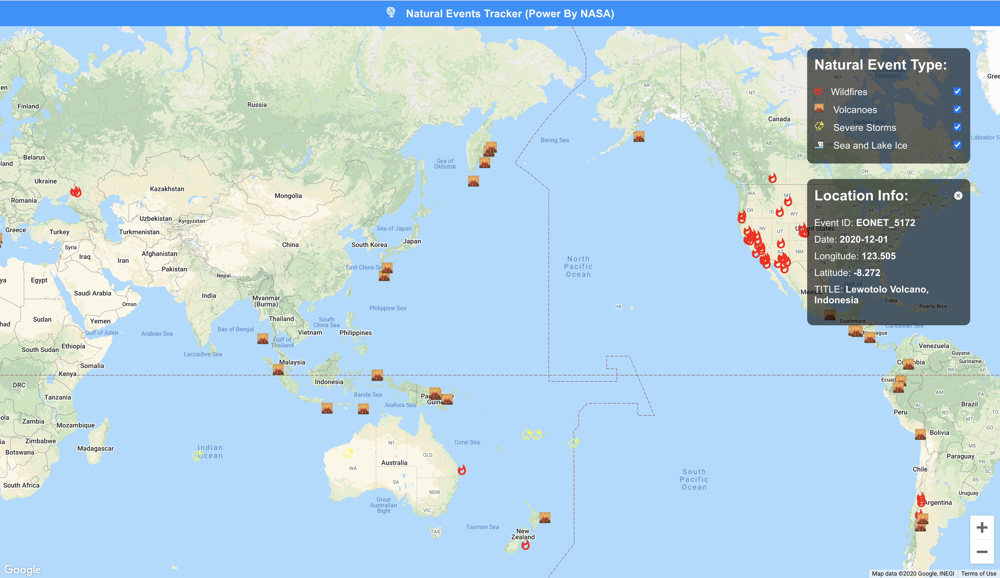

# Natural-events-tracker-doc-heroku

## Introduction:
- How to bulid this app:[https://github.com/DonghaoWu/natural-events-tracker-doc-heroku/blob/main/GoogleMap-NASA-API.md](https://github.com/DonghaoWu/natural-events-tracker-doc-heroku/blob/main/GoogleMap-NASA-API.md)
- Deploy Heroku URL:[https://natural-events-tracker-2021.herokuapp.com/](https://natural-events-tracker-2021.herokuapp.com/)

- This is a natural events tracker application with added features from a Youtube video tutorial.

- Youtube URL:[Build a Wildfire Tracker With React & NASA API](https://www.youtube.com/watch?v=ontX4zfVqK8)

## Documentation:

- [Google Cloud Platform](https://cloud.google.com/)
- [Adding Custom Environment Variables in CRA](https://create-react-app.dev/docs/adding-custom-environment-variables/)
- [NASA open APIs](https://api.nasa.gov/)
- [NASA EONET API documentation](https://eonet.sci.gsfc.nasa.gov/docs/v2.1)
- [NPM google-map-react](https://www.npmjs.com/package/google-map-react)
- [Heroku Configuration and Config Vars](https://devcenter.heroku.com/articles/config-vars)
- [Heroku Buildpack for create-react-app](https://github.com/mars/create-react-app-buildpack)